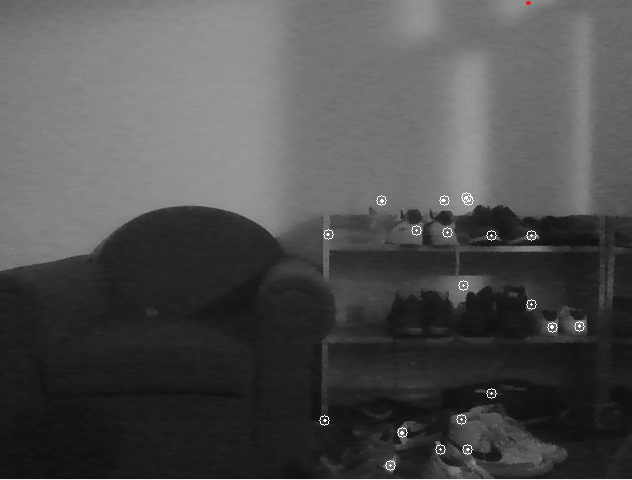

# Calculating Camera Movement

The goal of this project is to implement a Simultaneous Localization and Mapping (SLAM) algorithm that maps points of interest in a camera's field of view. This requires calculating the camera's essential matrix, rotation matrix, and translation vector. This code accomplishes this by building on the previous frame's rotation and translation vectors to maintain accuracy.



## Building

The project is written in C++ and uses features from the C++17
standard. [CMake](https://cmake.org/) is used to build all components.
and works well with the
[CMakeTools](https://marketplace.visualstudio.com/items?itemName=ms-vscode.cmake-tools)
extension in VSCode.

To configure it manually, type

```
cd build
cmake ..
```

then build it using

```
cmake --build .
```

Either method will generate an executable in the build directory.

## Running

Running this game requires the OpenCV library to be installed. This
is done very easily on MacOS and Windows through [MSYS2](https://www.msys2.org/#installation). <br>

In the MSYS2 terminal, the following command can be run to install the library and
configure all pathing for dll files.<br>
`pacman -S mingw-w64-x86_64-opencv`

Once the OpenCV library is installed and the program has been built using CMake, `.\build\____` (name of executable within build folder) can be run.

## Program Overview

The 'VideoCapture" class is used to access the camera, specifically the webcam of the machine runing the code.

```C++
cv::VideoCapture capture; // private data type
VideoCapture::VideoCapture() : capture{0}{} // 0 -> webcam
```

The 'VideoCapture' class also gathers frames, which are used in the 'Features' class to find "features" or points that can be used for calculations later. Constructing an object of Features looks like this.

```C++
Features previous = find_good_features(video_capture.get_next_frame());
Features current {video_capture.get_next_frame()};
```

The `filter_points` function uses OpenCV's built-in library to calculate the optical flow of the two frames, updates the vector of points in both `previous` and `current`. This ensures that the points on the screen move smoothly and accurately in relation to the camera's movement.

The next step is to calculate the essential matrix, rotation matrix, and translation vector using the following OpenCV functions:

```C++
cv::Mat essential_matrix = cv::findEssentialMat(previous.points, current.points);
cv::Mat rPrev, tPrev; // previous rotation and translation that will build on itself each frame
cv::recoverPose(essential_matrix, previous.points, current.points, rPrev, tPrev);
```

These steps are then all repeated in the loop, with each iteration having a new frame read in.<br><br>
The rotation matrix and translation vector are accumulated in the loop using the following formula:

```C++
tPrev = tPrev + 1.0 * (rPrev * translation_vector);
rPrev = rotation_matrix * rPrev;
```

To draw the points and corresponding trail, the following loops can be used:

```C++
for (auto point : current.points){
    cv::circle(current.image, point, 5, cv::Scalar(255));
}
for (std::size_t i = 0; i < current.points.size(); ++i){
    cv::line(current.image, previous.points.at(i), current.points.at(i), cv::Scalar(255), 2);
}
```

The final step of the program is to set the current frame to the previous frame since a new one will be read in during the next iteration.
The frame that the points and trails were drawn on is outputted.

```C++
previous = current;
cv::imshow("current_frame", current.image);
```

The loop will run until you press esc.

```C++
if (cv::waitKey(10) == 27) {break;}
```

The `CMakeLists.txt` file includes two executables: `webcam` for running the program described above and calibrate for finding the essential matrix needed to `calibrate` a camera.<br>
_For documentation on camera calibration see_ `camera_calibration.cpp`
